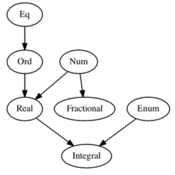

# Chapter 6 - Typeclasses

## 6.2 - What are typeclasses?

- Type declarations define how that type in particular is created.  _Typeclasses_ define how sets of types are consumed or used in computations.

- Typeclasses are similar to _interfaces_ in other languages.  They allow us to generalise over a set of types in order to define and execute a standard set of features for those types.

- For example, we want to be able to test values of a range of types for equality:
    - We do not need separate equality functions for each datatype.
    - Instead any datatype that is an instance of the `Eq` typeclass has a `==` operation.
    - If a type is an _instance_ of a typeclass, the type has an implementation for all of the operations defined in the typeclass.


## 6.3 - `Bool` and some common typeclasses

- Can see the typeclasses that a type instantiates using `:i` in GHCI:

    ```haskell
    > :i Bool
    data Bool = False | True        -- Defined in ‘GHC.Types'
    instance Bounded Bool -- Defined in ‘GHC.Enum’
    instance Enum Bool -- Defined in ‘GHC.Enum’
    instance Eq Bool -- Defined in ‘GHC.Classes’
    instance Ord Bool -- Defined in ‘GHC.Classes’
    instance Read Bool -- Defined in ‘GHC.Read’
    instance Show Bool -- Defined in ‘GHC.Show’
    ```

- Shows some common typeclasses:
    - `Bounded` - for types that have an upper and lower bound.
    - `Enum` - for types whose values can be enumerated.
    - `Eq` - for types whose values can be tested for equality.
    - `Ord` - for types whose values can be ordered.
    - `Read` - parses strings into instances of the type.
    - `Show` - renders instances of the type into strings.

- Typeclasses can have a hierarchy, e.g. all `Fractional` numbers implement `Num`

    ```haskell
    > :i Fractional 
    class Num a => Fractional a where ...
    ```


## 6.4 - The `Eq` typeclass

- `Eq` is the typeclass that allows types to define a notion of equality:

    ```haskell
    > :info Eq
    class Eq a where
    (==) :: a -> a -> Bool
    (/=) :: a -> a -> Bool
    ...
    ```

- The types of these two functions show the constrained type variable:

    ```haskell
    > :t (==)
    (==) :: Eq a => a -> a -> Bool
    > :t (/=)
    (/=) :: Eq a => a -> a -> Bool
    ```


## 6.5 - Writing typeclass instances

- To avoid manually writing instances of common typeclasses, they can be _derived_:

    ```haskell
    > data Foo = Bar | Blort deriving Eq
    > Bar == Foo
    False
    ```

- To define an `Eq` instance, you just need to implement _either_ `(==)` or `(/=)`:

    ```haskell
    data Trivial = Trivial
    instance Eq Trivial where
        Trivial == Trivial = True
    ```

- Recommended to keep the typeclass instances for a type in the same file as that type.

- When writing cases for a function, be careful to make sure we don't end up with a _partial function_ - one that doesn't handle all cases
    - Set GHCi's `Wall` flag to show warning for partial functions: `:set -Wall`.

- Sometimes we need the type variable to have certain typeclass instances:

    ```haskell
    data Identity a = Identity a
    instance Eq (Identity a) where
        (==) (Identity v) (Identity v') = v == v'
    ```

  This won't work - we can't guarantee to be able to call `v == v'` since the type variable `a` is not constrained to have an instance of `Eq`.  Instead we use a typeclass constraint:

    ```haskell
    instance Eq a => Eq (Identity a) where
        (==) (Identity v) (Identity v') = v == v'
    ```

## 6.6 - The `Num` typeclass

- `Num` is implemented by most numeric types, and defines common arithmetic operations:

    ```haskell
    > :i Num
    class Num a where
      (+) :: a -> a -> a
      (-) :: a -> a -> a
      (*) :: a -> a -> a
      negate :: a -> a
      abs :: a -> a
      signum :: a -> a
      fromInteger :: Integer -> a
    ```

- `Integral` has the following definition:

    ```haskell
    > :i Integral
    class (Real a, Enum a) => Integral a where
      quot :: a -> a -> a
      rem :: a -> a -> a
      div :: a -> a -> a
      mod :: a -> a -> a
      quotRem :: a -> a -> (a, a)
      divMod :: a -> a -> (a, a)
      toInteger :: a -> Integer
    ```

- `(Real a, Enum a)` means that any type that implements `Integral` must also have instances for `Real` _and_ `Enum`:
    - In turn, `Real` has a constraint of `(Num a, Ord a)`.
    - `Real` cannot override methods in `Num`, this type inheritance is additive only - i.e. new methods.
    - This avoids ambiguity problems caused by traditional multiple inheritance.

- `Fractional` is another subclass of `Num`:

    ```haskell
    class Num a => Fractional a where
      (/) :: a -> a -> a
      recip :: a -> a
      fromRational :: Rational -> a
    ```


## 6.7 - Type-defaulting typeclasses

- When evaluating a type-class constrained polymorphic value, the polymorphism must be resolved to a specific concrete type.

- In some cases, especailly in GHCi, it's possible to not have specified a concrete type for a polymorphic value, and for one not to be able to be inferred (e.g. through funciton type signatures).

- In these , the following defaults are specified for numerical computations:

    ```haskell
    default Num Integer
    default Real Integer
    default Enum Integer
    default Integral Integer
    default Fractional Double
    default RealFrac Double
    default Floating Double
    default RealFloat Double
    ```

- So, for example, the defaulting for `Fractional` means that:

    ```haskell
    (/) :: Fractional a => a -> a -> a
    ```

  defaults to the following if you don't specify the concrete type desired for `(/)`:

    ```haskell
    (/) :: Double -> Double -> Double
    ```

## 6.8 - The `Ord` typeclass


- `Ord` covers things that have a notion of ordering and can be compared:

    ```haskell
    > :i Ord
    class Eq a => Ord a where
      compare :: a -> a -> Ordering
      (<) :: a -> a -> Bool
      (<=) :: a -> a -> Bool
      (>) :: a -> a -> Bool
      (>=) :: a -> a -> Bool
      max :: a -> a -> a
      min :: a -> a -> a
    ```

- `compare` returns an `Ordering`, a sum type consisting of `LT`, `EQ` or `GT`:

    ```haskell
    > compare 7 8
    LT
    > compare True False
    GT
    > compare "Foo" "Foo"
    EQ
    ```

- If we have a simple datatype, we can derive `Ord`, but we must also derive (or provide) an instance for `Eq`.

- If we have a datatype declaration that declares a sum type, we can derive `Ord` and the ordering is defined by the order of the data constructors in the type declaration:

    ```haskell
    data DayOfWeek = 
        Mon | Tue | Wed | Thu | Fri | Sat | Sun
        deriving (Eq, Ord, Show)
    > Mon > Tue
    False
    > Sun > Mon
    True
    > compare Tue Wed
    LT
    ```

- Since `Ord` extends `Eq`, this means that any type with an `Ord` instance must also have an `Eq` instance.  So if we apply a typeclass constraint of `Ord a` we can also use methods declared in `Eq`:

    ```haskell
    check :: Ord a => a -> a -> Bool
    check a a' = a == a'
    ```

## 6.9 - The `Enum` typeclass

- `Enum` covers types that are enumerable, having a concept of predecessors and successors:

    ```haskell
    > :i Enum
    class Enum a where
      succ :: a -> a
      pred :: a -> a
      toEnum :: Int -> a
      fromEnum :: a -> Int
      enumFrom :: a -> [a]
      enumFromThen :: a -> a -> [a]
      enumFromTo :: a -> a -> [a]
      enumFromThenTo :: a -> a -> a -> [a]
    ```

- The various `enumFrom...` functions allow us to create ranges:

    > enumFromTo 10 15
    [10, 11, 12, 13, 14, 15]
    > enumFromThenTo 10 12 20
    [10, 12, 14, 16, 18, 20]


## 6.10 - The `Show` typeclass

- `Show` allow the creation of a human-readable string representation of structured data (e.g. for GHCi to print values in terminal):

    ```haskell
    > :i Show
    class Show a where
      showsPrec :: Int -> a -> ShowS
      show :: a -> String
      showList :: [a] -> ShowS
    ```

- The type signature of `print` shows us that it outputs the value of a printable type:

    ```haskell
    > :t print
    print :: Show a => a -> IO ()
    ```

- Here, `IO ()` denotes that the result of `print` is an I/O action that returns a value of the type `()`:
    - `()` is the empty tuple, also referred to as _unit_.
    - Represents 'nothing' - similar to `void` types in other languaes.


## 6.11 - The `Read` typeclass

- `Read` is essentially the opposite of `Show` - takes strings and turns them into things:

    ```haskell
    > :i Read
    class Read a where
      readsPrec :: Int -> ReadS a
      readList :: ReadS [a]
      -- And more...
    ```

- `read` has a problem, in that it is a _partial function_, since an exception might occur if given an unparseable value:

    ```haskell
    > read "foo" :: Integer
    *** Exception: Prelude.read: no parse
    ```


## 6.12 - Instances are dispatched by type

- _Typeclass instances_ are the unqiue pairing of a typeclass and a type.  They define the way to implement the typeclass methods for that type.

- Haskell uses the type of the thing on which the method is called to dispatch the actual method call.


## 6.13 - Using more operations

- If we want our function implementations to use more operations, we need to add further typeclass constraints to the type signature of the function.

- This means that our function is applicable to fewer concrete types, but the function itself is potentially more powerful.

- Concrete types imply all the typeclasses they provide:

    ```haskell
    add :: Int -> Int -> Int
    add x y = x + y

    addWeird :: Int -> Int -> Int
    addWeird x y =
        if x > 1
        then x + y
        else x

    check :: Int -> Int -> Bool
    check a a' = a == a'
    ```

  In the above, the `Int` type has the typeclasses `Num`, `Eq` and `Ord` so all the above are type-valid.  We don't need to say, for example, `Ord Int => Int -> Int -> Int` here - the typeclass constraint `Ord Int` is redundant.


## 6.16 - Partial typeclass inheritance


